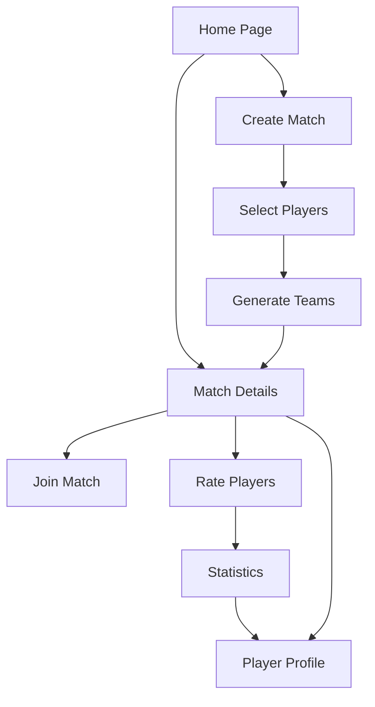

## 1. Product Overview
A football match management platform that organizes casual football games with automatic team balancing, player ratings, and engaging social features. Players create profiles, join matches, rate teammates, and enjoy a fun, gamified experience with playful UI elements.

The platform solves the problem of organizing fair, balanced football matches while adding social engagement through player ratings and statistics tracking. Target users are casual football players who want organized games with balanced teams.

## 2. Core Features

### 2.1 User Roles
| Role | Registration Method | Core Permissions |
|------|---------------------|------------------|
| Player | Email/Phone registration | Create profile, join matches, rate teammates, view statistics |
| Match Organizer | Automatic upgrade from Player | Create matches, manage player rosters, set match details |
| Admin | Manual assignment | Platform management, user moderation, system configuration |

### 2.2 Feature Module
Our football match management platform consists of the following main pages:
1. **Home page**: Match listings, upcoming games, quick join functionality
2. **Player profile page**: Personal stats, match history, photo gallery, nickname display
3. **Match details page**: Team lineups, player ratings, match results, top performers
4. **Create match page**: Match setup, player selection, team generation
5. **Player ratings page**: Post-match rating interface, rating history
6. **Statistics page**: Leaderboards, personal achievements, team statistics

### 2.3 Page Details
| Page Name | Module Name | Feature description |
|-----------|-------------|---------------------|
| Home page | Match listings | Display upcoming matches with date, time, location, player count. Show join/leave buttons. Filter by date/location. |
| Home page | Quick actions | Create new match button, view my matches, access player profile. |
| Player profile page | Profile header | Display player photo, nickname, overall rating, position preference. Edit profile functionality. |
| Player profile page | Statistics | Show matches played, wins/losses, average rating received, goals scored. |
| Player profile page | Match history | List recent matches with results and personal performance. |
| Match details page | Match info | Show match details: date, time, location, format (5v5, 7v7, etc.). |
| Match details page | Team display | Show balanced teams with player photos, nicknames, and ratings. |
| Match details page | Results | Display final score, goal scorers, match duration, and statistics. |
| Match details page | Top performers | Highlight best-rated players, goal scorers, and standout performances. |
| Create match page | Match setup | Set date, time, location, match format, max players. |
| Create match page | Player selection | Add players from friend list or recent matches. |
| Create match page | Team balancing | Automatic team generation based on player ratings for fair matches. |
| Player ratings page | Rating interface | Rate teammates (1-5 stars) with optional comments. Cannot rate yourself. |
| Player ratings page | Rating summary | View ratings received and given, with breakdown by category. |
| Statistics page | Leaderboards | Top-rated players, most active players, best goal scorers. |
| Statistics page | Achievements | Fun badges and milestones for player engagement. |

## 3. Core Process

### Player Flow
1. Player registers and creates profile with photo and nickname
2. Player browses available matches on home page
3. Player joins match or creates new match
4. System automatically balances teams based on ratings
5. Match is played and results are recorded
6. Players rate teammates after the match
7. Statistics and ratings are updated automatically

### Match Organizer Flow
1. Organizer creates match with basic details
2. Adds players to match roster
3. System generates balanced teams automatically
4. Organizer can manually adjust teams if needed
5. After match, organizer inputs final score and goal scorers
6. System calculates and displays top performers

## 4. User Interface Design

### 4.1 Design Style
- **Primary colors**: Football green (#2E7D32) and white
- **Secondary colors**: Blue accent (#1976D2) for actions, orange (#FF6B35) for highlights
- **Button style**: Rounded corners with subtle shadows, playful 3D effect on hover
- **Font**: Modern sans-serif (Roboto/Inter), 16px base size
- **Layout**: Card-based design with rounded corners and soft shadows
- **Icons**: Football-themed emojis and custom icons, playful and engaging

### 4.2 Page Design Overview
| Page Name | Module Name | UI Elements |
|-----------|-------------|-------------|
| Home page | Match listings | Card-based match cards with football field background, team colors, player avatars in circular frames. |
| Player profile | Profile header | Large circular photo, nickname in bold 24px font, rating stars, editable fields with pencil icons. |
| Match details | Team display | Football field visualization with player positions, drag-and-drop for manual adjustment. |
| Statistics | Leaderboards | Trophy icons, gold/silver/bronze color coding, animated progress bars. |

### 4.3 Responsiveness
Mobile-first design with responsive breakpoints at 768px and 1024px. Touch-optimized interactions with swipe gestures for match browsing and pinch-to-zoom for team displays. Progressive web app capabilities for mobile installation.