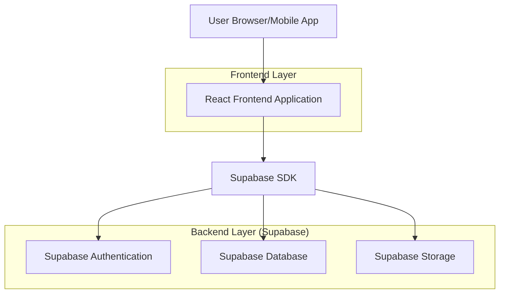
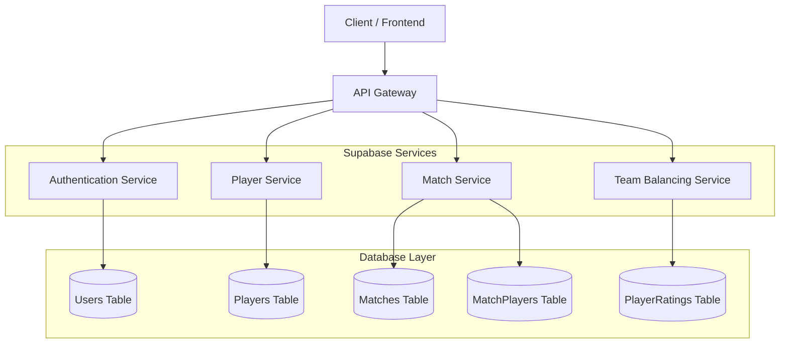
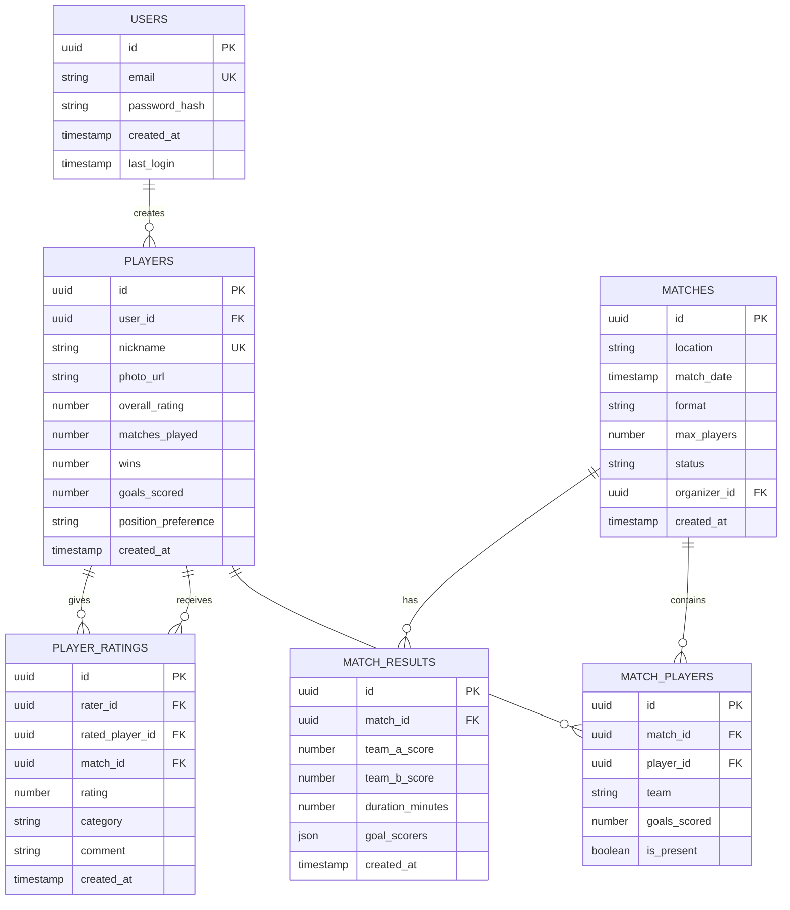

## 1. Architecture design



## 2. Technology Description

- **Frontend**: React@18 + React Native@0.72 + TypeScript@5 + TailwindCSS@3 + Vite
- **Backend**: Supabase (PostgreSQL@15, Authentication, Storage, Real-time)
- **State Management**: React Context + Custom Hooks
- **UI Components**: HeadlessUI + Custom Components
- **Image Processing**: Sharp for image optimization
- **Mobile**: React Native with Expo for cross-platform deployment

## 3. Route definitions

| Route | Purpose |
|-------|---------|
| / | Home page with match listings and quick actions |
| /login | User authentication page |
| /register | New user registration |
| /profile/:id | Player profile with statistics and match history |
| /matches | List of all matches |
| /matches/:id | Match details with teams and results |
| /matches/create | Create new match interface |
| /matches/:id/rate | Post-match player rating interface |
| /statistics | Leaderboards and achievements |
| /settings | User preferences and account settings |

## 4. API definitions

### 4.1 Authentication APIs

```
POST /auth/register
```

Request:
| Param Name | Param Type | isRequired | Description |
|------------|------------|------------|-------------|
| email | string | true | User email address |
| password | string | true | User password |
| nickname | string | true | Player nickname |
| phone | string | false | Optional phone number |

Response:
| Param Name | Param Type | Description |
|------------|------------|-------------|
| user | object | User object with id, email, nickname |
| session | object | Authentication session token |

### 4.2 Player Management APIs

```
GET /api/players/:id
```

Response:
| Param Name | Param Type | Description |
|------------|------------|-------------|
| id | string | Player unique identifier |
| nickname | string | Player display name |
| photo_url | string | Profile photo URL |
| overall_rating | number | Average rating (1-5) |
| matches_played | number | Total matches participated |
| wins | number | Number of wins |
| goals_scored | number | Total goals scored |

```
POST /api/players/:id/rate
```

Request:
| Param Name | Param Type | isRequired | Description |
|------------|------------|------------|-------------|
| match_id | string | true | Match identifier |
| rating | number | true | Rating from 1-5 |
| category | string | true | Rating category (skill, teamwork, sportsmanship) |
| comment | string | false | Optional comment |

### 4.3 Match Management APIs

```
POST /api/matches
```

Request:
| Param Name | Param Type | isRequired | Description |
|------------|------------|------------|-------------|
| date | string | true | Match date (ISO format) |
| time | string | true | Match time |
| location | string | true | Match location |
| format | string | true | Match format (5v5, 7v7, 11v11) |
| max_players | number | true | Maximum players allowed |

```
POST /api/matches/:id/join
```

Request:
| Param Name | Param Type | isRequired | Description |
|------------|------------|------------|-------------|
| player_id | string | true | Player joining the match |

```
POST /api/matches/:id/results
```

Request:
| Param Name | Param Type | isRequired | Description |
|------------|------------|------------|-------------|
| team_a_score | number | true | Team A final score |
| team_b_score | number | true | Team B final score |
| goal_scorers | array | true | Array of {player_id, goals} |
| duration | number | true | Match duration in minutes |

### 4.4 Team Balancing APIs

```
POST /api/matches/:id/balance-teams
```

Response:
| Param Name | Param Type | Description |
|------------|------------|-------------|
| team_a | array | Array of player objects for Team A |
| team_b | array | Array of player objects for Team B |
| balance_score | number | Team balance score (lower is better) |

## 5. Server architecture diagram



## 6. Data model

### 6.1 Data model definition



### 6.2 Data Definition Language

**Users Table**
```sql
CREATE TABLE users (
    id UUID PRIMARY KEY DEFAULT gen_random_uuid(),
    email VARCHAR(255) UNIQUE NOT NULL,
    password_hash VARCHAR(255) NOT NULL,
    created_at TIMESTAMP WITH TIME ZONE DEFAULT NOW(),
    last_login TIMESTAMP WITH TIME ZONE,
    
    CONSTRAINT email_format CHECK (email ~* '^[A-Za-z0-9._%+-]+@[A-Za-z0-9.-]+\.[A-Za-z]{2,}$')
);

-- Indexes
CREATE INDEX idx_users_email ON users(email);
CREATE INDEX idx_users_created_at ON users(created_at DESC);

-- RLS Policies
ALTER TABLE users ENABLE ROW LEVEL SECURITY;
CREATE POLICY "Users can view own profile" ON users FOR SELECT USING (auth.uid() = id);
CREATE POLICY "Users can update own profile" ON users FOR UPDATE USING (auth.uid() = id);
```

**Players Table**
```sql
CREATE TABLE players (
    id UUID PRIMARY KEY DEFAULT gen_random_uuid(),
    user_id UUID REFERENCES users(id) ON DELETE CASCADE,
    nickname VARCHAR(50) UNIQUE NOT NULL,
    photo_url TEXT,
    overall_rating DECIMAL(3,2) DEFAULT 3.00 CHECK (overall_rating >= 1 AND overall_rating <= 5),
    matches_played INTEGER DEFAULT 0,
    wins INTEGER DEFAULT 0,
    goals_scored INTEGER DEFAULT 0,
    position_preference VARCHAR(20) DEFAULT 'any' CHECK (position_preference IN ('goalkeeper', 'defender', 'midfielder', 'forward', 'any')),
    created_at TIMESTAMP WITH TIME ZONE DEFAULT NOW(),
    updated_at TIMESTAMP WITH TIME ZONE DEFAULT NOW()
);

-- Indexes
CREATE INDEX idx_players_user_id ON players(user_id);
CREATE INDEX idx_players_nickname ON players(nickname);
CREATE INDEX idx_players_rating ON players(overall_rating DESC);

-- RLS Policies
ALTER TABLE players ENABLE ROW LEVEL SECURITY;
CREATE POLICY "Players are publicly viewable" ON players FOR SELECT USING (true);
CREATE POLICY "Users can update own player profile" ON players FOR UPDATE USING (user_id = auth.uid());

-- Grant permissions
GRANT SELECT ON players TO anon;
GRANT ALL ON players TO authenticated;
```

**Matches Table**
```sql
CREATE TABLE matches (
    id UUID PRIMARY KEY DEFAULT gen_random_uuid(),
    location VARCHAR(255) NOT NULL,
    match_date TIMESTAMP WITH TIME ZONE NOT NULL,
    format VARCHAR(10) NOT NULL CHECK (format IN ('5v5', '7v7', '11v11')),
    max_players INTEGER NOT NULL CHECK (max_players > 0),
    status VARCHAR(20) DEFAULT 'upcoming' CHECK (status IN ('upcoming', 'in_progress', 'completed', 'cancelled')),
    organizer_id UUID REFERENCES players(id),
    created_at TIMESTAMP WITH TIME ZONE DEFAULT NOW(),
    updated_at TIMESTAMP WITH TIME ZONE DEFAULT NOW()
);

-- Indexes
CREATE INDEX idx_matches_date ON matches(match_date);
CREATE INDEX idx_matches_status ON matches(status);
CREATE INDEX idx_matches_organizer ON matches(organizer_id);

-- RLS Policies
ALTER TABLE matches ENABLE ROW LEVEL SECURITY;
CREATE POLICY "Matches are publicly viewable" ON matches FOR SELECT USING (true);
CREATE POLICY "Organizers can update own matches" ON matches FOR UPDATE USING (organizer_id = (SELECT id FROM players WHERE user_id = auth.uid()));
CREATE POLICY "Organizers can create matches" ON matches FOR INSERT WITH CHECK ((SELECT id FROM players WHERE user_id = auth.uid()) IS NOT NULL);

-- Grant permissions
GRANT SELECT ON matches TO anon;
GRANT ALL ON matches TO authenticated;
```

**Match Players Table**
```sql
CREATE TABLE match_players (
    id UUID PRIMARY KEY DEFAULT gen_random_uuid(),
    match_id UUID REFERENCES matches(id) ON DELETE CASCADE,
    player_id UUID REFERENCES players(id) ON DELETE CASCADE,
    team VARCHAR(1) CHECK (team IN ('A', 'B')),
    goals_scored INTEGER DEFAULT 0,
    is_present BOOLEAN DEFAULT true,
    joined_at TIMESTAMP WITH TIME ZONE DEFAULT NOW(),
    
    UNIQUE(match_id, player_id)
);

-- Indexes
CREATE INDEX idx_match_players_match ON match_players(match_id);
CREATE INDEX idx_match_players_player ON match_players(player_id);
CREATE INDEX idx_match_players_team ON match_players(match_id, team);

-- RLS Policies
ALTER TABLE match_players ENABLE ROW LEVEL SECURITY;
CREATE POLICY "Match players are publicly viewable" ON match_players FOR SELECT USING (true);
CREATE POLICY "Players can join matches" ON match_players FOR INSERT WITH CHECK (player_id = (SELECT id FROM players WHERE user_id = auth.uid()));
CREATE POLICY "Organizers can update match players" ON match_players FOR UPDATE USING (EXISTS (SELECT 1 FROM matches WHERE matches.id = match_players.match_id AND matches.organizer_id = (SELECT id FROM players WHERE user_id = auth.uid())));

-- Grant permissions
GRANT SELECT ON match_players TO anon;
GRANT ALL ON match_players TO authenticated;
```

**Player Ratings Table**
```sql
CREATE TABLE player_ratings (
    id UUID PRIMARY KEY DEFAULT gen_random_uuid(),
    rater_id UUID REFERENCES players(id) ON DELETE CASCADE,
    rated_player_id UUID REFERENCES players(id) ON DELETE CASCADE,
    match_id UUID REFERENCES matches(id) ON DELETE CASCADE,
    rating DECIMAL(2,1) NOT NULL CHECK (rating >= 1 AND rating <= 5),
    category VARCHAR(20) NOT NULL CHECK (category IN ('skill', 'teamwork', 'sportsmanship')),
    comment TEXT,
    created_at TIMESTAMP WITH TIME ZONE DEFAULT NOW(),
    
    UNIQUE(rater_id, rated_player_id, match_id, category),
    CONSTRAINT no_self_rating CHECK (rater_id != rated_player_id)
);

-- Indexes
CREATE INDEX idx_ratings_rated_player ON player_ratings(rated_player_id);
CREATE INDEX idx_ratings_match ON player_ratings(match_id);
CREATE INDEX idx_ratings_category ON player_ratings(category);

-- RLS Policies
ALTER TABLE player_ratings ENABLE ROW LEVEL SECURITY;
CREATE POLICY "Ratings are publicly viewable" ON player_ratings FOR SELECT USING (true);
CREATE POLICY "Players can create ratings" ON player_ratings FOR INSERT WITH CHECK (rater_id = (SELECT id FROM players WHERE user_id = auth.uid()));

-- Grant permissions
GRANT SELECT ON player_ratings TO anon;
GRANT ALL ON player_ratings TO authenticated;
```

**Match Results Table**
```sql
CREATE TABLE match_results (
    id UUID PRIMARY KEY DEFAULT gen_random_uuid(),
    match_id UUID REFERENCES matches(id) ON DELETE CASCADE,
    team_a_score INTEGER NOT NULL CHECK (team_a_score >= 0),
    team_b_score INTEGER NOT NULL CHECK (team_b_score >= 0),
    duration_minutes INTEGER NOT NULL CHECK (duration_minutes > 0),
    goal_scorers JSONB DEFAULT '[]'::jsonb,
    created_at TIMESTAMP WITH TIME ZONE DEFAULT NOW(),
    
    UNIQUE(match_id)
);

-- Indexes
CREATE INDEX idx_match_results_match ON match_results(match_id);

-- RLS Policies
ALTER TABLE match_results ENABLE ROW LEVEL SECURITY;
CREATE POLICY "Match results are publicly viewable" ON match_results FOR SELECT USING (true);
CREATE POLICY "Organizers can create match results" ON match_results FOR INSERT WITH CHECK (EXISTS (SELECT 1 FROM matches WHERE matches.id = match_results.match_id AND matches.organizer_id = (SELECT id FROM players WHERE user_id = auth.uid())));

-- Grant permissions
GRANT SELECT ON match_results TO anon;
GRANT ALL ON match_results TO authenticated;
```

### 6.3 Database Functions

**Update Player Rating Function**
```sql
CREATE OR REPLACE FUNCTION update_player_overall_rating()
RETURNS TRIGGER AS $$
BEGIN
    UPDATE players 
    SET overall_rating = (
        SELECT AVG(rating)::decimal(3,2)
        FROM player_ratings 
        WHERE rated_player_id = NEW.rated_player_id
    ),
    updated_at = NOW()
    WHERE id = NEW.rated_player_id;
    
    RETURN NEW;
END;
$$ LANGUAGE plpgsql;

CREATE TRIGGER trigger_update_player_rating
    AFTER INSERT OR UPDATE ON player_ratings
    FOR EACH ROW
    EXECUTE FUNCTION update_player_overall_rating();
```

**Team Balancing Function**
```sql
CREATE OR REPLACE FUNCTION balance_teams(match_uuid UUID)
RETURNS TABLE(team_a UUID[], team_b UUID[]) AS $$
DECLARE
    players_list UUID[];
    total_players INTEGER;
    team_size INTEGER;
BEGIN
    -- Get all players for the match ordered by rating
    SELECT ARRAY_AGG(player_id ORDER BY overall_rating DESC)
    INTO players_list
    FROM match_players mp
    JOIN players p ON mp.player_id = p.id
    WHERE mp.match_id = match_uuid;
    
    total_players := array_length(players_list, 1);
    team_size := total_players / 2;
    
    -- Simple snake draft for balance
    RETURN QUERY
    SELECT 
        players_list[1:team_size] as team_a,
        players_list[team_size+1:total_players] as team_b;
END;
$$ LANGUAGE plpgsql;
```